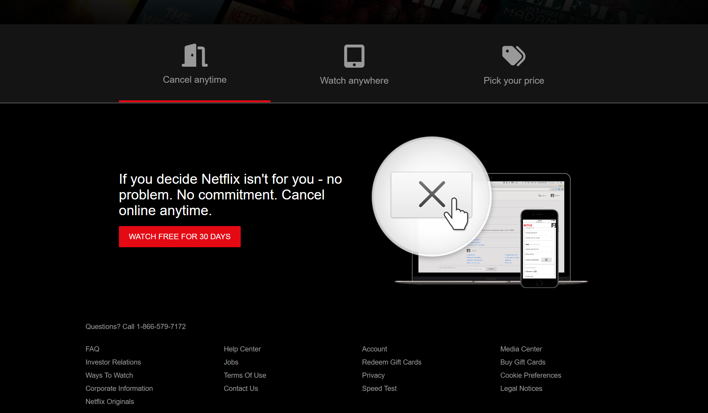

# Netflix-Landing-Page-Clone

A responsive Netflix landing page created using HTML, CSS, and JavaScript.

## Preview




## Features

- Responsive design
- Modern UI
- Smooth scrolling
- Interactive elements with JavaScript

## Technologies Used

- HTML
- CSS
- JavaScript

## Installation

1. Clone the repository:
   ```bash
   git clone https://github.com/yourusername/Netflix-Landing-Page-Clone.git

2. Navigate to the project directory
    cd Netflix-Landing-Page-Clone

3. Open index.html in your web browser.
